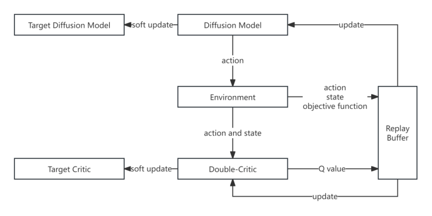

### DRL-GDM Algorithm for UAV aided Cell-free network

#### Background

Cell-Free MIMO network is a novel wireless communication architecture that distributes many single-antenna Access Points (APs) over a wide area and eliminates traditional cellular boundaries. All APs work collaboratively to simultaneously provide services to all users. In recent years, with the development of UAV technology, a UAV-assisted Cell-free massive MIMO system has been proposed. In this architecture UAVs take advantage of their high maneuverability to act as an aerial AP and collaborate with the ground base station to provide users with communication services that have broader coverage, greater flexibility and higher efficiency.

#### Optimization Goal

The aspects that need to be optimized for this architecture mainly include AP selection mechanisms, channel estimation methods, precoding methods, compression mechanisms, and dynamic optimization methods. But in aspects like channel estimation, precoding, and compression mechanisms, this new architecture adopts methods like those used in traditional ground-based AP network systems, and there are already relatively mature solutions available. Current research on this system mainly focuses on optimizing the following three aspects:

Clustering: In early stage of the cell-free system design, users are served by all the Aps in the system at the same time. Some Aps may contribute little to the overall channel capacity but brought heavy fronthaul burden. Later, the user-centric means were proposed [3][4], only a subset of the system will serve the target user. How to find the best cluster at the lowest computation cost is still under research.

Power allocation: When the AP's power is too high, although the designated user receives better service, it will also cause greater interference to other users. An algorithm which maximizes the overall network capacity while minimizing interference and ensuring efficient resource utilization. is needed to address this issue.

Position optimization: the major advantage of UAV aided cell-free network is the mobility of UAVs. In situations where there is a Ground AP failure or sudden increase of user number in certain areas, UAV can largely increase the overall service quality if they are deployed at the right place. In recent years, various algorithms have been used to solve this problem, and the performance of these algorithms is continuously improving.

#### Algorithm Structure

#### Run the project

Just run main.py under GDMOPT folder.
